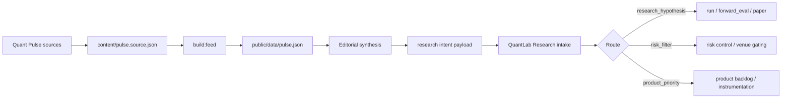

# Quant Pulse -> QuantLab Research Signal Intake Contract

## Purpose

Quant Pulse is an upstream signal layer for QuantLab Research.

Its job is not to produce trade picks directly.
Its job is to emit prioritized research intents, regime filters, and product priorities that QuantLab Research can validate through reproducible research.

## Core relationship

- Quant Pulse filters and structures signals.
- QuantLab Research validates those signals through `run`, `forward_eval`, paper sessions, and controlled execution boundaries.
- QuantLab Research remains autonomous.
- Quant Pulse only matters to QuantLab Research when it improves the research and validation cycle.

## Exact flow between repos

Quant Pulse should not hand QuantLab a raw article stream.
QuantLab Research should consume only canonical intents that cross the signal threshold.

Quant Pulse keeps the human feed and the intent handoff separate:

- `public/data/pulse.json` is for reading and review
- the intent payload is for downstream QuantLab consumption
- context-only stories stay upstream and do not become QuantLab work

## What Quant Pulse may provide

Allowed outputs from Quant Pulse:

- `signal_summary`
- `priority`
- `affected_universe`
- `bias`
- `horizon`
- `hypothesis_type`
- `validation_goal`
- `invalidation_condition`
- `risk_filter_hint`
- `product_priority_hint`

The canonical machine-readable format is defined upstream in Quant Pulse by:

- `config/research-intent.schema.json`

## When QuantLab should consume a signal

QuantLab Research should consume a Quant Pulse signal only if it can be translated into at least one of these:

- a testable research hypothesis
- a risk filter
- a product or instrumentation priority

If a signal cannot become one of those three things, it should not drive QuantLab Research's roadmap or execution behavior.

QuantLab Research routing after intake should be explicit:

- `research_hypothesis` -> research, comparison, forward evaluation, paper sessions
- `risk_filter` -> venue gating, exposure control, or exclusion logic
- `product_priority` -> backlog, tooling, or instrumentation
- context-only upstream items -> archive only, no action

## Recommended hypothesis families

Quant Pulse signals should usually map into one of these QuantLab Research families:

- trend
- mean reversion
- event-driven
- regime filter
- rotation

## Strong signal categories

Especially useful Quant Pulse input categories for QuantLab Research:

- Crypto & Markets
- Web3 market structure
- venue and execution-rail risk
- Technology only when it affects infra, security, or market structure
- Macro only when it materially changes crypto or technology conditions

## Non-goals

This contract does not mean:

- Quant Pulse decides trades
- Quant Pulse governs QuantLab
- Quant Pulse replaces QuantLab research
- QuantLab must act on every signal

## Example translation

Quant Pulse signal:

- "Regulatory pressure is improving the case for majors"

QuantLab Research research intent:

- validate trend-following on BTC and ETH versus the rest of the universe
- compare against baseline and mean-reversion alternatives
- forward-evaluate before any paper or execution use

## Consumer rule

QuantLab Research should treat the upstream intent as a structured hint, not as an execution instruction.
QuantLab Research remains responsible for the final decision to test, filter, defer, or ignore.

## Operational rule

Quant Pulse should only influence QuantLab Research when the signal can be expressed clearly enough to support:

- research
- validation
- risk control
- product prioritization

Otherwise, it stays as context, not as a driver.
